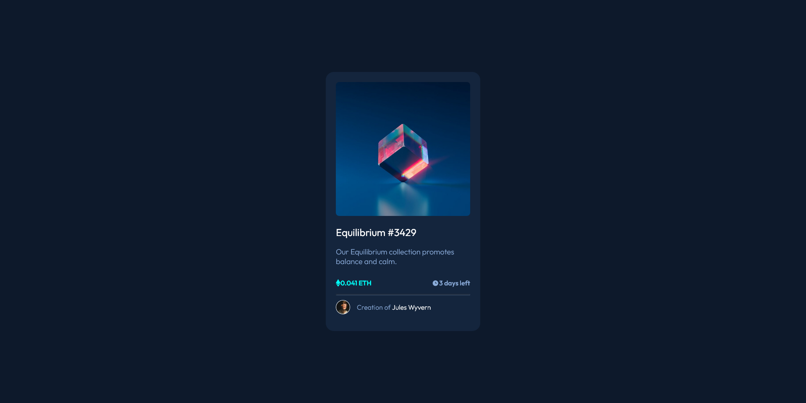
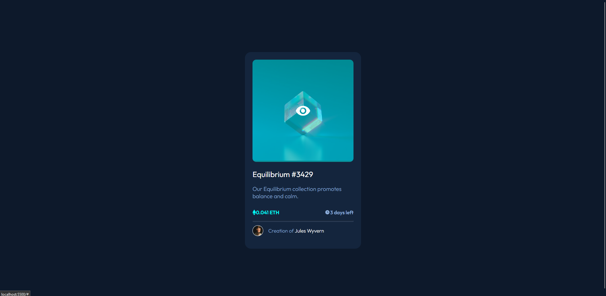

# Frontend Mentor - NFT preview card component solution

This is a solution to the [NFT preview card component challenge on Frontend Mentor](https://www.frontendmentor.io/challenges/nft-preview-card-component-SbdUL_w0U). Frontend Mentor challenges help you improve your coding skills by building realistic projects.

## Table of contents

- [Overview](#overview)
  - [The challenge](#the-challenge)
  - [Screenshot](#screenshot)
  - [Links](#links)
- [My process](#my-process)
  - [Built with](#built-with)
  <!-- - [What I learned](#what-i-learned) -->
  - [Continued development](#continued-development)
- [Author](#author)
- [Acknowledgments](#acknowledgments)

## Overview

### The challenge

Users should be able to:

- View the optimal layout depending on their device's screen size
- See hover states for interactive elements

### Screenshot




### Links

- Solution URL: [Link](https://www.frontendmentor.io/solutions/nft-preview-card-component--rY93YnkWw)
- Live Site URL: [Link](https://nft-card-component-jeymen.vercel.app/)

## My process

### Built with

- Semantic HTML5 markup
- CSS custom properties
- Flexbox

### What I learned

```css
.img {
  border-radius: 0.75em;
  overflow: hidden;
  position: relative;
}
.img img {
  width: 100%;
}
.img-overlay {
  position: absolute;
  left: 0;
  top: 0;
  height: 100%;
  width: 100%;
  background-color: hsla(178, 100%, 50%, 0.5);
  display: none;
}
.img-overlay img {
  position: relative;
  width: 3.125em;
  left: 50%;
  top: 50%;
  transform: translate(-50%, -50%);
}
.img:hover .img-overlay {
  display: block;
}
```

### Continued development

I would like to continue building this project and finish soeme things. I would like to make it mobile responsible.

<!-- ### Useful resources

- [Example resource 1](https://www.example.com) - This helped me for XYZ reason. I really liked this pattern and will use it going forward.
- [Example resource 2](https://www.example.com) - This is an amazing article which helped me finally understand XYZ. I'd recommend it to anyone still learning this concept.

**Note: Delete this note and replace the list above with resources that helped you during the challenge. These could come in handy for anyone viewing your solution or for yourself when you look back on this project in the future.** -->

## Author

- Frontend Mentor - [@Jeymen](https://www.frontendmentor.io/profile/yourusername)

## Acknowledgments

- [@Grace](https://www.frontendmentor.io/profile/grace-snow)
- [@Mr Coder](https://www.youtube.com/watch?v=l6sxh57ifSQ)
